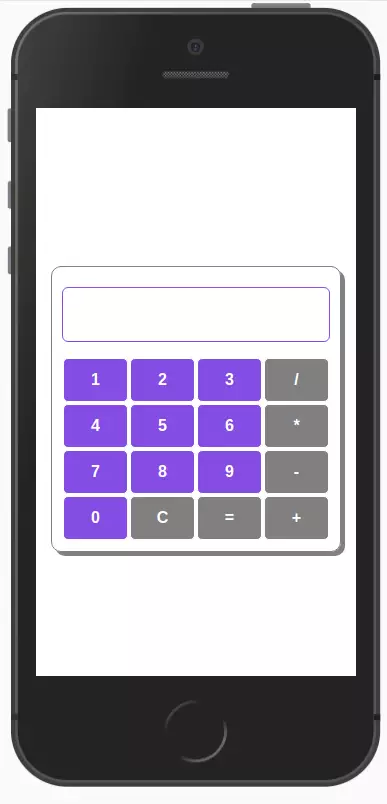

# SimpleCalculator

Neste pequeno projeto vou implementar meus conhecimentos iniciais na linguagem JavaScript.

Optei por criar uma simples calculadora, pois acredito ser um bom execício onde conseguirei mesclar os conhecimentos que já aprendi até o momento, acrescentando o JavaScript que para mim está sendo um novo conhecimento aprendido no curso que estou fazendo no momento.

# Tecnologias usadas

# Preview

Live demo: <a href="https://diegosouza007.github.io/SimpleCalculator/">https://diegosouza007.github.io/SimpleCalculator</a>
